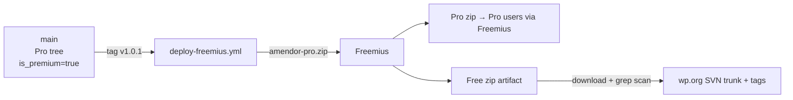
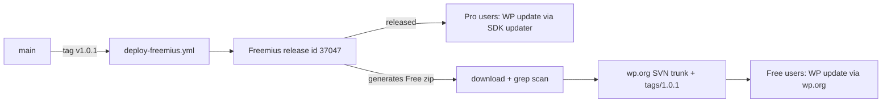

# Amendor — WordPress.org Compliance Fix Plan

> Task B: Implementation plan to resolve the review team's feedback.
>
> ⚠️ **No code changes have been applied.** This is a plan awaiting your
> approval. The single most important decision is **P0 / Path A vs Path B**
> (below) — everything else is mechanical.

---

## 0. Executive summary

| Priority | Issue | Effort | Risk if skipped |
|---|---|---|---|
| **P0** | Trialware / Pro build on wp.org (choose Path A or B) | Large | **Rejection** |
| P1 | Move inline ``
   block at `:468-508` (`.log-level-badge*`, `tr.log-level-*`,
   `.debug_log__options`).
2. **`assets/css/admin.css`** — append the same rules (namespaced under
   `.amendor-*` or the existing pattern; the file is already enqueued on all
   three plugin pages by `amendor_admin_enqueue_scripts()` in
   `admin-chrome.php:148-223`, so the styles will load on the debug-log page).
3. *(Optional, recommended)* move the inline `onclick="return confirm(...)"`
   handlers in `log-debug-page.php:278` and `presets.php:351` into
   `assets/js/admin.js` (data attributes + delegated listeners), using the
   already-localized `amendor_admin_vars` strings.

---

## P2. Nonces & permissions — no changes needed

Verified compliant (see analysis §2.3). During the P0 refactor, **preserve**:
- every form handler verifies its own nonce then calls
  `amendor_current_user_can_manage()`;
- every AJAX handler calls `check_ajax_referer()` then
  `amendor_current_user_can_manage()`;
- `current_user_can()` only inside `amendor_current_user_can_manage()`
  (enforced by `bin/check-structure.php`).

Do a final grep before upload for any handler touching `$_POST`/`$_GET`/`$_REQUEST`
that mutates data without a nonce.

---

## P3. Fix `Contributors` in `readme.txt`

- Change `readme.txt:2` `Contributors: TheBrandPlace` → the exact wp.org
  username(s) of the contributors (review AI indicates the owner account is
  `thebrandplaceltd` — confirm the exact casing on wordpress.org before
  editing). Case-sensitive; comma-separated if multiple.
- Optionally also fix the `Author:` header in `amendor.php` if it doesn't match
  a real wp.org identity (only if the reviewer flagged it — currently only the
  readme was flagged).

---

## P4. Align README with the shipped build

- Under **Path A**: "Key Features" may keep all features (they now all ship).
  Remove any "Pro" / "upgrade to unlock" phrasing.
- Under **Path B**: trim "Key Features" to what exists in the Free build; the
  removed items may be referenced only as *"available in the separate Amendor
  Pro plugin"* (no claim that wp.org users can use them).
- Ensure ≤ 5 tags, no affiliate/competitor tags, no keyword stuffing (§12).

---

## P5. Remove `load_plugin_textdomain()`

- **`includes/i18n.php`** — remove `amendor_load_textdomain()` (and the
  `// Hooked in main plugin file` comment).
- **`amendor.php`** — remove
  `add_action('plugins_loaded', 'amendor_load_textdomain');` and (under A1) the
  `require_once … i18n.php` line.
- Keep `languages/amendor.pot` (WP auto-loads translations for wp.org plugins).
- Re-run the pot generator if any strings change (P0/P1 touch strings).

---

## P6. Build, version, verify, resubmit

1. **Version bump (Guideline §15):** `1.0.0` → `1.0.1` (or `1.1.0`) in all four
   places: `amendor.php` header + `AMENDOR_VERSION` + `readme.txt` `Stable tag:`
   + POT `Project-Id-Version:`. Git tag must match.
2. **Build** per `docs/wp-org-upload-handoff.md` (or the Actions artifact under
   Path B). Single top-level `amendor/` folder, no `__MACOSX`/`.DS_Store`,
   exclude `bin/`, `docs/`, `.github/`, `composer.json`, `phpcs.xml*`.
3. **Pre-upload scan (on the exact zip that will be uploaded):**
   - `grep -rEni 'is__premium_only|can_use_premium_code|restrict_search_mode|gatekeeper|wp_org_gatekeeper|premium' …` → expect **no** hits (Path A) or only known-inert hits (Path B).
   - `grep -rEn '<script|<style' includes/` → no hits (P1 done).
   - `php -l` every PHP file; `node --check` both JS files; run
     `composer run check-structure` if composer is available.
   - Run **Plugin Check** (wp.org checker plugin) → clean at ERROR level.
4. **Manual smoke test on a clean WP 6.4+ install:** activate, run a regex
   search, bulk replace, preset save/apply, log export, Elementor editor tool,
   restore/undo, backup download. Confirm no fatal errors.
5. **Upload** the correct build to wp.org SVN (`trunk` + `tags/1.0.1`).

---

## Suggested reply to the review team (brief, per their instructions)

> Thank you for the review. All issues have been addressed: the wp.org build is
> now fully free and fully functional with all locked/premium-gated features
> removed (no license checks, no trialware); scripts/styles are enqueued
> properly; the Contributors field is corrected; the unnecessary
> `load_plugin_textdomain()` call was removed; and Freemius is configured in
> org-compliant mode with the correct Free build submitted. Version 1.0.1
> uploaded.

(Adjust the first clause if Path B was chosen: "the wp.org build is now the
Freemius-generated Free build with all premium code stripped and no license
gating; the README no longer advertises Pro features…")

---

## Sequencing

1. Get approval on **Path A vs Path B** (the only open question).
2. P0 → P5 code changes in one feature branch (`fix/wp-org-compliance`).
3. Run the structural check + lint + pot regen.
4. P6 build + scan + smoke test.
5. Push, tag `v1.0.1`, deploy Free artifact, upload to wp.org SVN, reply to the
   review thread.
